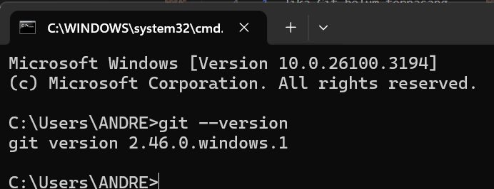
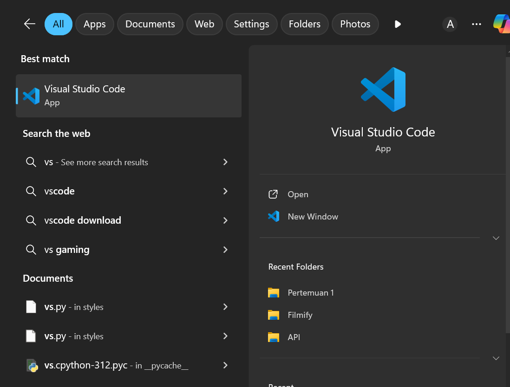
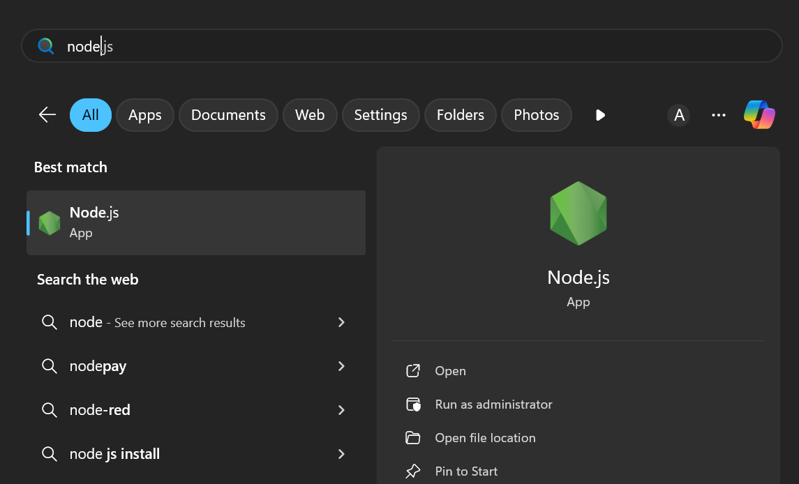

This is a [Next.js](https://nextjs.org) project bootstrapped with [`create-next-app`](https://nextjs.org/docs/app/api-reference/cli/create-next-app).

## Getting Started

First, run the development server:

```bash
npm run dev
# or
yarn dev
# or
pnpm dev
# or
bun dev
```

Open [http://localhost:3000](http://localhost:3000) with your browser to see the result.

You can start editing the page by modifying `app/page.tsx`. The page auto-updates as you edit the file.

This project uses [`next/font`](https://nextjs.org/docs/app/building-your-application/optimizing/fonts) to automatically optimize and load [Geist](https://vercel.com/font), a new font family for Vercel.

## Learn More

To learn more about Next.js, take a look at the following resources:

- [Next.js Documentation](https://nextjs.org/docs) - learn about Next.js features and API.
- [Learn Next.js](https://nextjs.org/learn) - an interactive Next.js tutorial.

You can check out [the Next.js GitHub repository](https://github.com/vercel/next.js) - your feedback and contributions are welcome!

## Deploy on Vercel

The easiest way to deploy your Next.js app is to use the [Vercel Platform](https://vercel.com/new?utm_medium=default-template&filter=next.js&utm_source=create-next-app&utm_campaign=create-next-app-readme) from the creators of Next.js.

Check out our [Next.js deployment documentation](https://nextjs.org/docs/app/building-your-application/deploying) for more details.


## Laporan Praktikum

|  | Pemrograman Berbasis Framework 2025 - Pertemuan 1 |
|--|--|
| NIM |  2241720146|
| Nama |  Andreagazy Iza Amerianto |
| Kelas | TI - 3A |

#### Pertanyaan Praktikum 1
1. Jelaskan kegunaan masing-masing dari Git, VS Code dan NodeJS yang telah Anda install 
pada sesi praktikum ini!

- Git digunakan sebagai penyimpanan kode, melacak perubahan versi atau kode dalam praktikum ini.
- VSCode digunakan sebagai platform untuk melakukan menulis dan modifikasi kode dalam praktikum ini.
- NodeJS digunakan untuk menjalankan kode JavaScript di sisi server dengan menjalankan perintah  `npm run dev` untuk menjalankan aplikasi React.

2. Buktikan dengan screenshoot yang menunjukkan bahwa masing-masing tools tersebut telah berhasil terinstall di perangkat Anda!

- Instalasi Git



- Instalasi VSCode



- Instalasi NodeJS




#### Pertanyaan Praktikum 2

#### Pertanyaan Praktikum 2
1. Pada Langkah ke-2, setelah membuat proyek baru menggunakan Next.js, terdapat beberapa istilah yang muncul. Jelaskan istilah tersebut, **TypeScript, ESLint, Tailwind CSS, Import alias, App Router**, dan **Turbopack**!

- TypeScript adalah perluasan sintaks JavaScript yang menambahkan keamanan tipe dan fitur lainnya ke dalam JavaScript. File TypeScript memiliki ekstensi .ts atau .tsx
- ESLint adalah tools yang menganalisis kode dan mengidentifikasi kemungkinan masalah dan kesalahan dalam program.
- Tailwind CSS adalah framework CSS yang memudahkan pengembang membuat komponen CSS dengan class yang sudah terdapat pada framework tanpa harus menulis banyak CSS manual 
- Import Alias adalah fitur untuk mempersingkat path impor file
- App Router adalah sistem routing baru di Next.js 13+ yang berbasis direktori app/.
- Turbopack adalah  Bundler Next.js berbasis Rust yang menggantikan Webpack untuk build lebih cepat

2. Apa saja kegunaan folder dan file yang ada pada struktur proyek React yang tampil pada gambar pada tahap percobaan ke-3!

- .next: Menyimpan file hasil build Next.js, termasuk cache dan file untuk rendering halaman.
- node_modules: : Folder ini berisi semua dependensi paket yang diunduh melalui npm atau yarn yang digunakan dalam proyek
- public : Menyimpan file statis seperti gambar, favicon, dan aset lain yang bisa diakses langsung dari root URL.
- src : Folder utama yang berisi source code proyek, termasuk komponen, halaman, dan logika aplikasi.
- .gitignore : Menentukan file atau folder yang harus diabaikan oleh Git.
- eslint.config.mjs: Konfigurasi ESLint untuk memastikan kode tetap rapi dan sesuai standar.
- next-env.d.ts: Deklarasi TypeScript untuk proyek Next.js.
- next.config.ts: Konfigurasi tambahan untuk Next.js seperti optimasi dan pengaturan khusus lainnya.
- package.json: Berisi informasi proyek dan daftar dependensi yang digunakan.
- package-lock.json: Mengunci versi dependensi agar instalasi tetap konsisten.
- postcss.config.mjs: Konfigurasi PostCSS, sering digunakan bersama Tailwind CSS.
- tailwind.config.ts: Konfigurasi Tailwind CSS untuk menyesuaikan tema dan styling.
- tsconfig.json: File konfigurasi TypeScript untuk mengatur opsi kompilasi kode.
- README.md : File untuk dokumentasi proyek.

3. Buktikan dengan screenshoot yang menunjukkan bahwa tahapan percobaan di atas telah berhasil Anda lakukan!

- Pembuatan Folder


- Setelah dilakukan `npm run dev`


#### Pertanyaan Praktikum 3
1. Buktikan dengan screenshoot yang menunjukkan bahwa tahapan percobaan di atas telah 
berhasil Anda lakukan

- Fungsi MyButton 


- Penggunaan : 


- Hasil


